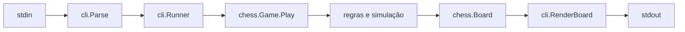

# Arquitetura

## Responsabilidades

- `internal/chess`: tipos do domínio, estado da partida, validação e aplicação de jogadas. Não conhece terminal nem texto de comando.
- `internal/cli`: converte texto em comandos, renderiza o tabuleiro e coordena a sessão.
- `cmd/chess`: conecta entrada/saída do processo ao runner.

Uma jogada passa pelo parser, pelo runner e por `Game.Play`. O domínio valida geometria, ocupação, regras especiais e uma cópia simulada contra auto-xeque; só então atualiza o tabuleiro, troca o turno e calcula o estado final.

## Dependências e limites

`cmd` pode depender de `cli`; `cli` pode depender de `chess`; `chess` não depende dos outros pacotes. Entrada, saída e mensagens de sessão pertencem à CLI. Estado e legalidade pertencem ao domínio.

Pontos de extensão naturais são novos renderizadores em `internal/cli`, notação adicional no parser e regras de empate no domínio. Invariantes: uma partida possui um turno; jogadas aceitas são legais; domínio não faz I/O; não existe estado global mutável.
