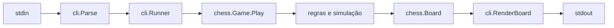

# Arquitetura

## Responsabilidades

- `internal/chess`: tipos do domínio, estado da partida, validação e aplicação de jogadas. Não conhece terminal nem texto de comando.
- `internal/cli`: converte texto em comandos, renderiza o tabuleiro e coordena a sessão.
- `cmd/chess`: conecta entrada/saída do processo ao runner.

Uma jogada passa pelo parser, pelo runner e por `Game.Play`. O domínio valida geometria, ocupação, regras especiais e uma cópia simulada contra auto-xeque; só então atualiza o tabuleiro, troca o turno e calcula o estado final, incluindo o registro da nova posição.

`Game` mantém, no domínio, um mapa de identidades comparáveis para contagem de repetições. Os construtores registram a posição inicial, `Play` registra somente jogadas aceitas e `Restart` substitui a partida por uma nova contagem. Comandos de apresentação da CLI não passam por esse histórico.

## Dependências e limites

`cmd` pode depender de `cli`; `cli` pode depender de `chess`; `chess` não depende dos outros pacotes. Entrada, saída e mensagens de sessão pertencem à CLI. Estado e legalidade pertencem ao domínio.

O estado da partida fica em `Game`: tabuleiro, turno, término, alvo en passant e histórico de posições. Direitos de roque e en passant efetivo são derivados desse estado quando necessários. Veja [`docs/domain/game-state.md`](domain/game-state.md).

## Estratégia de testes

Regras são testadas diretamente em `internal/chess`, construindo posições explícitas quando necessário. Parser e sessão são testados em `internal/cli`; testes de runner usam leitores e buffers, sem I/O real. O fluxo recomendado é teste focado, suíte do pacote e então `make check`.

## Pontos de extensão

Novas regras e condições de empate pertencem ao domínio; novos comandos, renderizadores e notações pertencem à CLI. Interfaces só são introduzidas com benefício concreto. Invariantes: uma partida possui um turno; jogadas aceitas são legais; domínio não faz I/O; não existe estado global mutável.

Para desenvolvimento assistido, `CLAUDE.md` roteia contexto, agentes especializados ficam em `.claude/agents` e `.codex/agents`, e skills reutilizáveis em `.claude/skills` com um link em `.codex/skills`. A política de delegação está em `AGENTS.md`.
